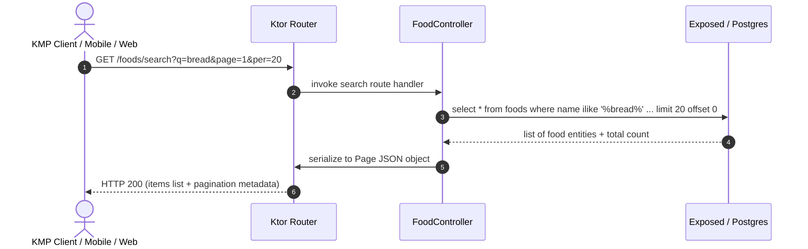

# Technical Architecture Specification: Kotlin Backend Replicated Service

This document describes the technical architecture and implementation details for the Kotlin-based parallel backend `GlutenFreeKtorAPI`.

## 1. Tech Stack Selection

*   **Runtime & JVM**: Kotlin JVM targeted at **Java 21** with **Kotlin 2.0+**.
*   **Web Engine**: **Ktor Server** using the **Netty** asynchronous embedded web engine.
*   **Database Access (ORM)**: **Exposed ORM** (JetBrains) for type-safe database queries.
*   **Database Pooling**: **HikariCP** for high-performance database connection pooling.
*   **Database Driver**: **PostgreSQL JDBC Driver** (`org.postgresql:postgresql`).
*   **Dependency Injection**: **Koin Core/Server** (`io.insert-koin:koin-ktor`) to match client-side dependency injection patterns.
*   **Serialization**: **Kotlinx Serialization** (`io.ktor:ktor-serialization-kotlinx-json`) for asynchronous high-efficiency JSON parsing.

---

## 2. System Architecture & Component Mapping

The backend follows a clean, decoupled architectural style:

```
┌────────────────────────────────────────────────────────┐
│                        HTTP/CORS                       │
├────────────────────────────────────────────────────────┤
│                      Routing Layer                     │
├────────────────────────────────────────────────────────┤
│                    Controller / Handler                │
├────────────────────────────────────────────────────────┤
│                       Service / ORM                    │
├────────────────────────────────────────────────────────┤
│                  Database (Exposed/Postgres)           │
└────────────────────────────────────────────────────────┘
```

### Flow Sequence Diagram: Product Query with Search



---

## 3. Project Directory Structure

The Kotlin Ktor backend project will be organized inside a new root folder called `GlutenFreeKtor/` parallel to `GlutenFreeAPI/` and `FreeGluKMP/`.

```
GlutenFreeKtor/
├── build.gradle.kts
├── gradle.properties
├── gradlew
├── settings.gradle.kts
├── src/
│   ├── main/
│   │   ├── kotlin/
│   │   │   └── com/glufree/ktor/
│   │   │       ├── Application.kt (EntryPoint)
│   │   │       ├── configure/
│   │   │       │   ├── CORS.kt
│   │   │       │   ├── Serialization.kt
│   │   │       │   ├── Routing.kt
│   │   │       │   └── Database.kt
│   │   │       ├── controllers/
│   │   │       │   └── FoodController.kt
│   │   │       ├── models/
│   │   │       │   ├── Food.kt
│   │   │       │   └── Pagination.kt
│   │   │       └── di/
│   │   │           └── AppModule.kt
│   │   └── resources/
│   │       └── application.conf
│   └── test/
│       └── kotlin/
│           └── com/glufree/ktor/
│               └── ApplicationTest.kt
└── Dockerfile
```

---

## 4. Database Schema Parity (Exposed ORM)

The `foods` table structure defined in Exposed must map EXACTLY to the PostgreSQL schema managed by Swift Vapor's Fluent migration:

```kotlin
package com.glufree.ktor.models

import org.jetbrains.exposed.dao.id.UUIDTable
import org.jetbrains.exposed.sql.javatime.datetime
import java.util.UUID

object FoodsTable : UUIDTable("foods", "id") {
    val code = varchar("code", 255)
    val name = varchar("name", 255)
    val brand = varchar("brand", 255).nullable()
    val categories = text("categories").nullable()
    val ingredients = text("ingredients").nullable()
    val imageUrl = varchar("image_url", 512).nullable() // Mapped to column image_url
    val countries = varchar("countries", 255).nullable()
    val glutenFree = bool("gluten_free") // Mapped to column gluten_free
    val createdAt = datetime("created_at").nullable() // Mapped to created_at
}
```

---

## 5. REST Contract Parity

To be fully interchangeable with Swift Vapor, Ktor must use identical JSON properties (camelCase in JSON, snake_case in Database columns).

### Food JSON Object Representation:
```kotlin
@Serializable
data class FoodResponse(
    val id: String,
    val code: String,
    val name: String,
    val brand: String? = null,
    val categories: String? = null,
    val ingredients: String? = null,
    val imageUrl: String? = null,
    val countries: String? = null,
    val glutenFree: Boolean,
    val createdAt: String? = null
)
```

### Pagination Page Schema (Page Metadata):
```kotlin
@Serializable
data class PaginationMetadata(
    val page: Int,
    val per: Int,
    val total: Long
)

@Serializable
data class PageResponse<T>(
    val items: List<T>,
    val metadata: PaginationMetadata
)
```

---

## 6. Risk Assessment & Mitigations

*   **Risk**: Collation or ILIKE behavior differences between Vapor PostgreSQL driver and JVM PostgreSQL driver.
    *   *Mitigation*: Exposed's `FoodsTable.name.lowerCase() like "%$query%"` maps to standard case-insensitive matches, or raw SQL fragments can be injected for native Postgres ILIKE binding. We will utilize `FoodsTable.name.lowerCase() like searchPattern` as the safe cross-compatible solution or explicitly call `FoodsTable.name.customOp("ILIKE")` inside Ktor.
*   **Risk**: Docker container port collisions.
    *   *Mitigation*: When launching both backends simultaneously, the Swift Vapor service will bind to port `8080`, and the Kotlin Ktor service will bind to `8081` (or be configurable via the `PORT` environment variable).
